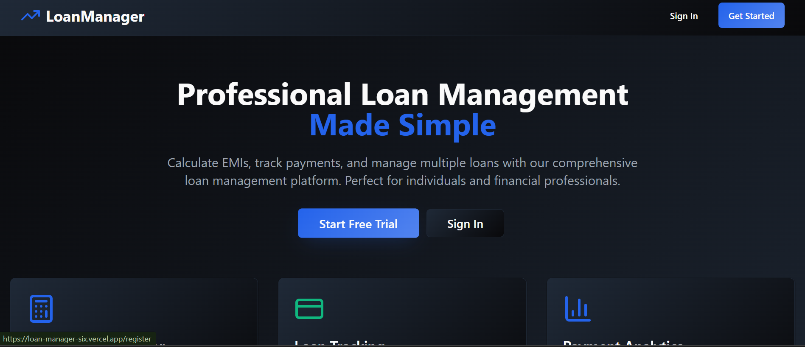
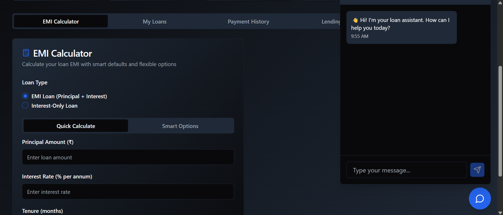
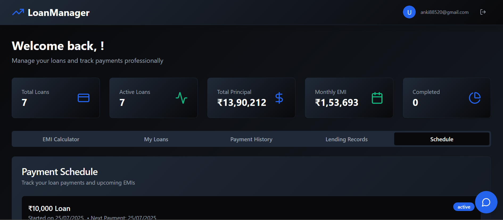

# 📊 LoanManager


A **Professional Loan Management Platform** that simplifies loan tracking, EMI calculations, and borrower management.  
Perfect for individuals, small businesses, and financial professionals.

🌐 **Live Demo**: [LoanManager App](https://loan-manager-six.vercel.app)  

---

## 🚀 Features

- ✅ **EMI Calculator** – Smart & quick EMI calculations  
- ✅ **Loan Tracking** – Track active & completed loans  
- ✅ **Payment History & Schedule** – View upcoming EMIs & past transactions  
- ✅ **Lending Records** – Manage borrower data efficiently  
- ✅ **Payment Analytics** – Visual representation of loan stats  
- ✅ **AI Chat Assistant** – Integrated loan assistant for user queries  
- ✅ **Secure Authentication** – Sign up & manage your personal loans  

---

## 🛠️ Tech Stack

**Frontend:**  
- React (TypeScript)  
- Tailwind CSS + ShadCN/UI Components  
- Vite (development server)

**Backend:**  
- Node.js + Express.js  
- MongoDB (Mongoose ODM)  

**Deployment:**  
- **Frontend**: Vercel  
- **Backend**: Render / Railway  

---

## 📂 Project Structure

```
LoanManager/
│
├── frontend/         # React + Tailwind frontend
│   ├── src/
│   └── ...
│
├── backend/          # Node.js + Express backend
│   ├── server.js
│   └── models/
│
└── README.md         # Project documentation
```

---

## ⚙️ Installation & Setup

### **1. Clone the Repository**

```bash
git clone https://github.com/AnKiT-GaRG2/LoanManager.git
cd LoanManager
```

### **2. Backend Setup**

```bash
cd backend
npm install
```

Create a `.env` file in the `backend` folder and add:

```
MONGO_URI=your_mongodb_connection_string
PORT=5000
```

Start the backend server:

```bash
node server.js
# OR for development
npx nodemon server.js
```

### **3. Frontend Setup**

```bash
cd frontend
npm install
npm run dev
```

The React app should now run on `http://localhost:5173/`.

---

## 📸 Screenshots

### **Landing Page**


### **Dashboard Overview**


### **EMI Calculator & Loan Assistant**


---

## 🌐 Deployment

- **Frontend**: [Vercel](https://vercel.com/)  
- **Backend**: [Render](https://render.com/) or [Railway](https://railway.app/)  

---

## 🤝 Contributing

Contributions are welcome!  

1. Fork the repo  
2. Create a new branch (`feature/new-feature`)  
3. Commit your changes  
4. Open a Pull Request  

---

## 📧 Contact

**Ankit Garg**  
📩 [Your Email or LinkedIn here]  
⭐ If you like this project, don’t forget to give it a star!

---

## 📝 License

This project is licensed under the [MIT License](LICENSE).
